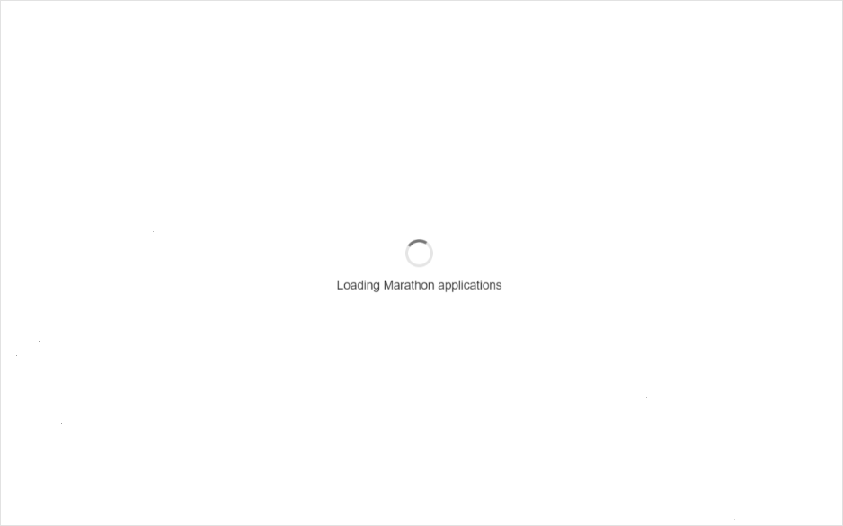

# mesos-marathon-browser
[](https://travis-ci.org/petr-k/mesos-marathon-browser)

mm-browser provides a simple interface to browse applications in a Mesos/Marathon cluster, along with some associated metadata such as Docker image labels. It is meant to complement the official Marathon UI.



Some of its features include:
* Shows basic application settings and instance counts
* Periodically refreshes applications and their properties with current state in Marathon
* Quick filtering of the application list
* Conveniently shows Marathon application labels and Docker image labels in one place

## Running
Please refer to [petkr/mesos-marathon-browser](https://hub.docker.com/r/petkr/mesos-marathon-browser/) on Docker Hub for instructions on how to run the application in a Docker container.

## Development

The application is built with React (using [create-react-app](https://github.com/facebookincubator/create-react-app)), [Redux](https://github.com/reactjs/redux) and [Flow](https://flow.org/). It also includes a Node server that takes care of serving the static assets, talking to remote Docker registries and proxying calls to Marathon.

### Getting started
```
yarn install:dev // in contrast to `yarn install`, installs dependencies both for the client and server
yarn start // starts the client in development hot-reload mode + starts the server
```

See the `package.json` file for more commands.

### Running tests
```
yarn test // runs Jest in watch mode
```
